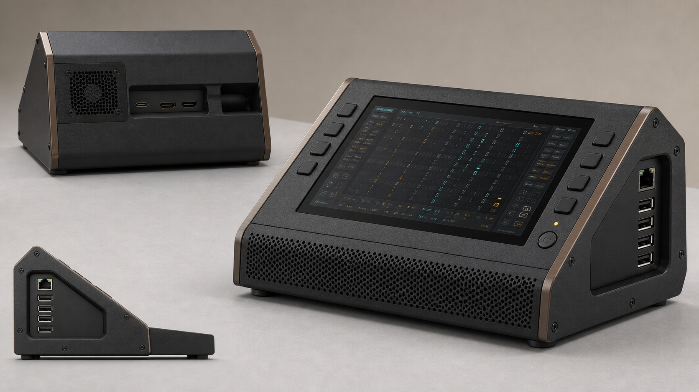

## 1. Final design

The resolved design is a compact wedge console, provisionally **190 × 165 × 96 mm**, with a 7-inch landscape display rising **22° above horizontal**. A tall rear heel levels the enclosure on the desk and contains the exhaust fan, cable bay, and rear service hatch.

The display is **not rotated 180°**. Its connector edge remains at the raised rear, where short internal cables enter a protected gutter. This keeps cables, controls, and strain relief away from the front intake and the operator’s hands.

The product character comes from its restrained dark wedge profile, bronze side rails, recessed screen, eight low-profile controller keys, and perforated metal grilles—not decorative meters or imitation analog hardware.

## 2. Repository and hardware findings

Repository state was confirmed on the commit-pinned GitHub tree before design work:

`927eb05888951f9955c7d46e856ef7208149bc00`

The workspace could not resolve GitHub for a local `git clone`, so I inspected GitHub’s revision-pinned tree rather than claiming a checkout. No files or documentation from `main` or another revision were used.

### Verified

- SHR-DAW targets a compact **40 × 13 terminal**, with software instruments, sequencing, loops, effects, JACK recording, and optional MIDI equipment. It accepts a **computer keyboard, mouse, or configured four-, five-, or eight-button controller**. [Commit-pinned repository and README](https://github.com/PaolaShultz/shr-daw/tree/927eb05888951f9955c7d46e856ef7208149bc00)
- Nothing in the commit-pinned README or visible repository hardware description identifies an exact display, NVMe board, enclosure plate, fan, or touch requirement.
- Raspberry Pi 5 is approximately **85 × 56 mm**, with a **58 × 49 mm mounting pattern**. Its native external interfaces include one USB-C power input, two micro-HDMI, four USB-A, Ethernet, microSD, two MIPI connectors, PCIe FFC, GPIO, RTC battery, fan connector, and power button. It does **not** have two native USB-C connectors. [Pi 5 mechanical drawing](https://datasheets.raspberrypi.com/rpi5/raspberry-pi-5-mechanical-drawing.pdf), [Pi 5 product specification](https://www.raspberrypi.com/products/raspberry-pi-5/)
- The USB-A/Ethernet bank occupies one short edge; USB-C power and micro-HDMI occupy a long edge. [Pi 5 drawing](https://datasheets.raspberrypi.com/rpi5/raspberry-pi-5-mechanical-drawing.pdf)
- The official Active Cooler is approximately **63.5 × 42.5 × 13.7 mm**, uses the Pi’s dedicated 5 V PWM/tach fan connector, and is rated at up to 1.09 CFM. Raspberry Pi recommends leaving it fitted once installed. [Active Cooler brief](https://datasheets.raspberrypi.com/cooling/raspberry-pi-active-cooler-product-brief.pdf)
- Raspberry Pi recommends the 27 W USB-C supply. A recognized 5 A supply raises the shared USB/fan peripheral budget to 1.6 A; a 3 A supply restricts it to 600 mA. [Pi power documentation](https://www.raspberrypi.com/documentation/computers/raspberry-pi.html)

### Reasonable inference

The 40 × 13 TUI and repository screenshots indicate a landscape working format. Touch is optional rather than foundational because the documented input model is keyboard, mouse, or button controller.

### Explicit design assumptions

- **Display reference:** Elecrow RC070N, selected because its two USB-C connectors match the ambiguity in the brief. It is 7-inch, 1024 × 600, approximately **165 × 123 mm**, with mini-HDMI, USB-C touch/power, and a second USB-C power input. This is a packaging reference, not an identification of the owner’s display. Its manual specifically says not to power the Pi through the display and recommends the display’s dedicated power port. [Elecrow RC070N manual](https://www.elecrow.com/download/product/AUS24600C/Elecrow_7_Inch_HDMI_Touchscreen_Monitor_User_Manua.pdf)
- **NVMe reference:** Pimoroni NVMe Base PIM699 beneath the Pi. It measures approximately **87.6 × 56 mm**, uses 7 mm standoffs, and accepts 2230–2280 M-key NVMe drives. [Product page](https://shop.pimoroni.com/products/nvme-base?variant=41219587178579), [dimensional drawing](https://cdn.shopify.com/s/files/1/0174/1800/files/nvme-hat-drawing.pdf?v=1714386681)
- **Rear fan:** Noctua NF-A4x10 5V PWM, 40 × 40 × 10 mm, 32 mm mounting pitch, up to 5.24 CFM and 19.6 dB(A) free-field manufacturer rating. Installed enclosure performance will be lower. [Fan datasheet](https://noctua.at/pub/media/blfa_files/infosheet/noctua_nf_a4x10_5v_pwm_datasheet_en.pdf)

## 3. Orientation and connector decision

| Arrangement evaluated | Consequence | Decision |
|---|---|---|
| Connector edge raised at rear, native landscape | Protected cable gutter, shortest internal HDMI route, no touch remap, clear front intake | **Selected** |
| Display rotated 180°, connectors at low front | Right-angle plugs and strain relief occupy the intake plenum; cables sit near hands; poorer filter access; display and touch must both be remapped | Rejected |
| Portrait/90° rotation | Poor match to the 40 × 13 interface and wider enclosure needed for useful controls | Rejected |

The difficult edge should **not** be moved to the bottom/front. Raspberry Pi OS can rotate a display, but touch orientation is independent and may require separate input mapping; this adds failure modes without a mechanical benefit here. [Raspberry Pi display rotation guidance](https://www.raspberrypi.com/documentation/accessories/display.html#change-display-orientation)

The brief’s connector wording is resolved as follows:

- **Native Pi:** one USB-C power, two micro-HDMI, four USB-A, and Ethernet.
- **Assumed RC070N display:** two additional USB-C and one mini-HDMI.
- **NVMe Base:** internal PCIe FFC and M.2 connector.
- **Audio/MIDI:** external USB devices; Pi 5 has no native analog headphone/audio jack.

## 4. Mechanical and thermal specification

### Envelope and stance

- External envelope: **190 W × 165 D × 92–100 H mm**, provisional.
- Front height: **34–38 mm**.
- Screen angle: **22°**, acceptable CAD range 19–25°.
- Display cassette: adjustable slots for modules approximately **160–170 × 105–125 × ≤18 mm**.
- Foot footprint: approximately **168 × 145 mm**.
- Four 3 mm silicone feet; rear feet integrated into the leveling heel.
- Rear bumper projections maintain at least **12 mm exhaust clearance** from a wall.
- Target assembled mass: **0.9–1.2 kg**, provisional; the aluminum chassis contributes useful low ballast.

### Connector strategy

- **Right recessed pocket:** direct access to four USB-A and Gigabit Ethernet. USB audio and MIDI equipment connect here.
- **Rear recessed bay:** Pi USB-C power; two micro-HDMI openings, with HDMI0 occupied internally and HDMI1 available for service/secondary output.
- **Display mini-HDMI:** short micro-HDMI-to-mini-HDMI cable, internally retained.
- **Display USB-C power:** accessible in the rear bay and powered separately for the prototype.
- **Display USB-C touch:** optional. It is left disconnected in the baseline because SHR-DAW does not require touch; it can be looped to one USB-A port after rotation/input testing.
- **microSD:** left underside spring door, usable without removing the Pi.
- **Pi power control:** front-right normally-open switch connected to the documented J2 external-button pads; the nearby light pipe reproduces Pi status indication. [Pi external power-button documentation](https://www.raspberrypi.com/documentation/computers/raspberry-pi.html#add-your-own-power-button)
- **GPIO, MIPI, UART, RTC and PoE header:** internal service access only. PCIe is occupied by the NVMe Base. PoE is not supported in this enclosure revision.

Provide at least **26 mm** behind rear-facing plugs and a provisional **20–25 mm cable bend radius**. Two screwed P-clamps, placed 15–25 mm behind the connectors, carry cable strain rather than the board sockets.

### Stack and airflow

Top to bottom:

1. Glass/display module in a removable cassette.
2. **10–14 mm upper airflow plenum**.
3. Pi 5 with Active Cooler facing the plenum.
4. Pimoroni-style NVMe Base on 7 mm standoffs.
5. **6–10 mm lower NVMe channel**.
6. Sloped 1.5 mm aluminum electronics sled.
7. Level outer base and rear heel.

The front grille is approximately **150 × 22 mm**, with at least 50% net open area and a side-removable 30 PPI foam filter. A baffle sends a provisional 70% of inlet air straight through the display/Pi gap and 30% beneath the Pi over the NVMe Base.

The rear fan sits high in the heel with its strut side outward, pulling air from both channels and exhausting rearward. A foam fan gasket and short sealed shroud prevent exhaust from leaking back into the enclosure. Side-port apertures receive foam surrounds to limit bypass air.

Thermal treatment:

- **CPU/PMIC/RP1:** official Active Cooler, with unobstructed blower inlet and at least 8 mm clearance around its discharge.
- **Display:** rear controller board remains exposed to upper-plenum flow; no thermal pad is applied to the glass or LCD back.
- **NVMe:** lower channel crosses both faces. A spring-loaded aluminum spreader and electrically insulating 0.5–1.5 mm gap pad may be added only after the actual SSD component heights are measured.
- **Rear fan:** separate 5 V PWM/tach daughterboard; hardware default should be full speed if its control signal disappears. The Pi fan header remains dedicated to the Active Cooler.
- **Dust/noise:** filtered intake, vibration mounts, rounded grille transitions, no sharp internal baffle lips, and fan control with hysteresis. Manufacturer noise figures are not enclosure-level predictions.

### Construction and service

Prototype route:

- 2.5 mm SLS/MJF PA12 outer shell and rear hatch.
- 1.5 mm laser-cut, bent 5052-H32 aluminum sled.
- 2 mm anodized aluminum screen bezel and side rails.
- M2.5 machine screws into brass inserts; captive M2.5 rear-hatch screws; M3 fan screws with silicone isolators.
- Matte charcoal texture, black grilles, dark-bronze rails.
- Deburred metal edges, minimum R0.5 mm.

Production route would change the shell to 2.0–2.5 mm UL94-rated PC-ABS with molded ribs and threaded inserts, retaining the bent aluminum chassis.

Assembly sequence:

1. Fit grilles, filter rails, fan, feet, inserts, and J2 button harness.
2. Install display in its cassette and attach right-angle HDMI/power cables.
3. Fit the Active Cooler permanently.
4. Install SSD, PCIe FFC, NVMe Base, and Pi as a bench-tested stack.
5. Screw the stack to the sloped aluminum sled.
6. Route and clamp cables; verify fan, touch option, HDMI, and button.
7. Slide the sled into the shell, align direct port openings, then fit the base and rear hatch.

Routine fan, filter, power, and cable service uses the rear hatch. SSD/Pi removal uses the bottom sled. Screen replacement does not require removing the NVMe stack.

The eight unlabelled side keys accept a configurable eight-button HID/controller PCB. Legends should be a replaceable strip because the exact repository controller profile and key assignments must be confirmed before engraving.

## 5. The picture

[Open the 1672 × 941 PNG](concept-board.png)

It shows the selected front-right view, right-side Pi connector pocket, rear fan/cable bay, and level side stance. It is an appearance and packaging reference—not a dimensionally verified CAD rendering.

Created as exactly one image using the built-in image generator. The final prompt specified the resolved 190 × 165 mm, 22° wedge, front intake, rear 40 mm exhaust, four USB-A plus Ethernet pocket, rear connector gutter, and consistent multi-view geometry.

## 6. Risks and validation

The first CAD pass should not begin from nominal dimensions alone. Required checks are:

- Photograph and caliper-measure the actual display, connector edge, button locations, mounting holes, board thickness, and cable insertion envelopes.
- Import manufacturer STEP files for the Pi, fan and selected NVMe board; scan any missing display geometry.
- Verify whether the actual display is RC070N. An official Touch Display 2, for example, is 189.32 × 120.24 mm and would require a wider enclosure and entirely different DSI/power routing. [Touch Display 2 brief](https://datasheets.raspberrypi.com/display/touch-display-2-product-brief.pdf)
- Do not merge the Pi and display power supplies until an electrical engineer validates current sharing, backfeed protection, fusing, grounding, and shutdown behavior. The safe prototype uses separate certified supplies.
- Run CPU stress, sustained `fio`, USB audio/JACK at the intended buffer size, and display at maximum brightness for at least 60 minutes at 20°C and 30°C ambient. Log SoC temperature, throttle flags, NVMe SMART temperature, fan tach, underruns and power warnings.
- Engineering target: keep the SoC below 75°C at the validation ambient and the SSD below its manufacturer’s throttling threshold. These are targets, not proven results.
- Repeat with rear fan failed, Active Cooler failed, filter half blocked, and rear exhaust 12 mm from a wall.
- Measure A-weighted and tonal noise at 0.5 m; tune fan curves and grille geometry from measurements.
- Smoke-test airflow for front-to-rear flow, lower-channel dead zones and port-pocket bypass.
- Apply a provisional 10 N touch load at screen corners and cable-pull loads at rear connectors; verify sliding and tip margin.
- Inspect HDMI/USB signal integrity with the final right-angle cables.
- Check Wi-Fi/Bluetooth RSSI; retain a polymer RF window beside the Pi antenna if the aluminum rails cause attenuation.
- Validate glass retention, spill paths, fan finger protection, electrical clearances, sharp edges, filter flammability, ESD and regulatory requirements. The enclosure is not liquid- or dust-sealed.

## 7. Comparison record

| Record item | Resolved value |
|---|---|
| Repository | `https://github.com/PaolaShultz/shr-daw` |
| Exact commit | `927eb05888951f9955c7d46e856ef7208149bc00` |
| Research date | 2026-07-24 |
| Identified hardware | Raspberry Pi 5; official Pi 5 Active Cooler |
| Unknown hardware | Actual display, NVMe/base board, SSD, bottom plate, existing fan, controller PCB and cables |
| Design assumptions | Elecrow RC070N display; Pimoroni PIM699 NVMe Base; Noctua NF-A4x10 5V PWM exhaust |
| Display orientation and angle | Native landscape, connector edge raised at rear; 22° above horizontal |
| Connector strategy | Four USB-A + Ethernet right; Pi USB-C and two micro-HDMI rear; display mini-HDMI internal; display power and optional touch USB-C in rear bay; microSD underside |
| External dimensions | Approximately 190 × 165 × 92–100 mm; front 34–38 mm |
| Cooling layout | Filtered front intake → upper Pi/display and lower NVMe channels → rear exhaust |
| Fan | One 40 × 40 × 10 mm, 5 V PWM fan; rearward exhaust |
| Component stack | Display / 10–14 mm plenum / Pi + Active Cooler / 7 mm NVMe Base / 6–10 mm lower channel / aluminum sled |
| Materials and route | SLS/MJF PA12 shell, bent 5052 aluminum sled, anodized bezel/rails; later PC-ABS tooling |
| Service access | Captive rear hatch, removable bottom sled, separate screen cassette, sliding front filter, microSD door |
| Principal advantages | Straight airflow, clean operator edge, protected cables, direct native ports, separate thermal paths, stable console stance |
| Principal compromises | Two prototype power inputs; touch optional; no built-in analog audio; somewhat larger than a bare 7-inch display |
| Unresolved assumptions | Exact display and SSD geometry, cable bend envelopes, button controller mapping, airflow split, acoustics, RF performance |
| Main sources | [Commit-pinned repo](https://github.com/PaolaShultz/shr-daw/tree/927eb05888951f9955c7d46e856ef7208149bc00); [Pi 5 drawing](https://datasheets.raspberrypi.com/rpi5/raspberry-pi-5-mechanical-drawing.pdf); [Pi 5 specification](https://www.raspberrypi.com/products/raspberry-pi-5/); [Active Cooler](https://datasheets.raspberrypi.com/cooling/raspberry-pi-active-cooler-product-brief.pdf); [RC070N manual](https://www.elecrow.com/download/product/AUS24600C/Elecrow_7_Inch_HDMI_Touchscreen_Monitor_User_Manua.pdf); [PIM699 drawing](https://cdn.shopify.com/s/files/1/0174/1800/files/nvme-hat-drawing.pdf?v=1714386681); [fan datasheet](https://noctua.at/pub/media/blfa_files/infosheet/noctua_nf_a4x10_5v_pwm_datasheet_en.pdf) |
| Image filename | `shr-daw-console-final.png` |