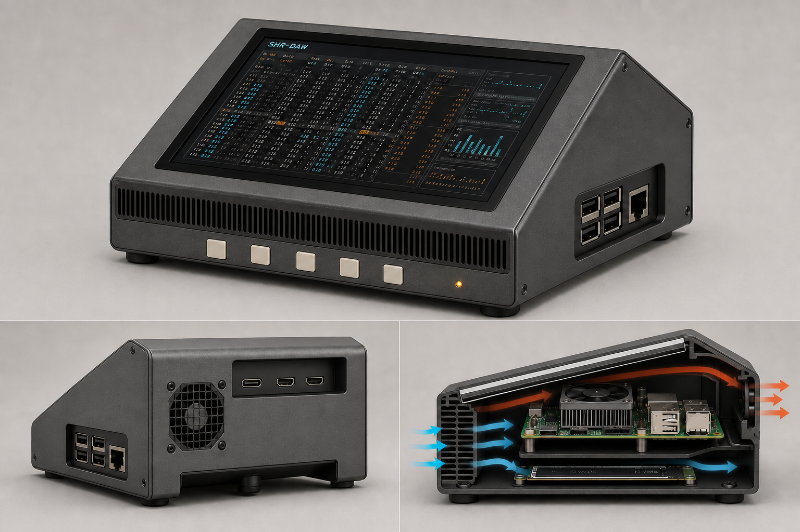

## 1. Final design

The resolved product is a compact, wedge-shaped “SHR Console 7”: a 7-inch landscape display over a parallel Raspberry Pi 5/NVMe stack, inclined approximately 24° above the table. The enclosure is provisionally 212 × 155 × 103 mm (W×D×rear H).

The current in-plane display orientation is retained. The Pi’s USB-C power and two micro-HDMI ports remain at the rear-high edge inside a recessed cable bay; the four USB-A ports and Ethernet connector receive direct side access. This avoids placing stiff cables in the front intake and control area.

A full-width front grille feeds the gap containing the official Pi Active Cooler. A lower airflow branch passes over the bottom-mounted NVMe device before both streams leave through one rear 40 mm 5 V PWM exhaust fan. Five physical controller keys, a recessed illuminated power button, and disciplined grille detailing provide the console character without unsupported knobs or fake audio connections.

## 2. Repository and hardware findings

Repository verification: a fresh clone was attempted, but the execution sandbox could not resolve GitHub. I therefore inspected the immutable [requested commit tree](https://github.com/PaolaShultz/shr-daw/tree/927eb05888951f9955c7d46e856ef7208149bc00); the page identifies revision `927eb05`. No default-branch files or screenshots were used for repository conclusions.

Verified repository facts:

- SHR-DAW is designed for a 40×13 terminal and includes instrument browsing, playback, FT2-style pattern/loop pages, recording, and performance-bus views.
- Supported input models include computer keyboard, mouse, and configured four-, five-, or eight-button controllers.
- Patchbox OS, Raspberry Pi OS, and Debian are named platforms. JACK is required for software audio, effects, loops, and recording, but SHR-DAW does not start or restart JACK.
- The wide 40×13 terminal and screenshot tour strongly imply landscape use, but the repository does not specify a physical panel, touchscreen, mounting plate, NVMe adapter, fan, or enclosure.

Verified Raspberry Pi facts:

- Raspberry Pi 5 has one native USB-C power input, two micro-HDMI outputs, two USB 3.0 and two USB 2.0 Type-A ports, Gigabit Ethernet, two combined MIPI camera/display connectors, PCIe FFC, microSD, GPIO, RTC battery, UART, and a four-pin PWM fan header. It does **not** have two additional native USB-C connectors or an analog audio jack. [Official hardware documentation](https://www.raspberrypi.com/documentation/computers/raspberry-pi.html) and [product brief/mechanical drawing](https://datasheets.raspberrypi.com/rpi5/raspberry-pi-5-product-brief.pdf).
- The PCB is nominally 85 × 56 mm; the official drawing shows an approximately 58 mm connector envelope and warns that published dimensions are reference values rather than production tooling data.
- Raspberry Pi recommends a 5 V/5 A USB-C supply. With a lesser 3 A supply, peripheral current is restricted; USB and fan loads share the power budget.
- The official Active Cooler is approximately 63.5 × 42.5 × 13.7 mm, uses the Pi’s 5 V PWM/tach fan header, and is rated at up to 1.09 CFM. Raspberry Pi advises against repeatedly removing it. [Active Cooler product brief](https://datasheets.raspberrypi.com/cooling/raspberry-pi-active-cooler-product-brief.pdf).

Clearly labelled design assumptions:

- **Display baseline:** official 7-inch Touch Display 2, because its 189.32 × 120.24 mm outline, 154.56 × 86.94 mm active area, 1280×720 landscape mode, DSI video/touch, and GPIO power produce a compact cable-free screen stack. It is not identified by the repository. [Current Touch Display 2 brief](https://pip-assets.raspberrypi.com/categories/1083-raspberry-pi-touch-display-2/documents/RP-009106-MM-6-Raspberry%20Pi%20Touch%20Display%202%20product%20brief.pdf).
- **NVMe baseline:** Pimoroni PIM699 NVMe Base, mounted below the Pi on its supplied 7 mm standoffs. It supports 2230–2280 M-key NVMe drives and measures about 87.6 × 56 mm. It is also an assumption, not repository hardware. [Manufacturer page](https://shop.pimoroni.com/en-us/products/nvme-base) and [dimensional drawing](https://cdn.shopify.com/s/files/1/0174/1800/files/nvme-hat-drawing.pdf?v=1714386681).
- **Exhaust fan:** Noctua NF-A4x10 5V PWM. It is nominally 40 × 40 × 10 mm; reserve 40 × 40 × 12 mm with pads. Manufacturer maxima are 8.9 m³/h, 19.6 dB(A), and 0.35 W—open-air ratings, not expected enclosure performance. [Manufacturer datasheet](https://noctua.at/pub/media/blfa_files/infosheet/noctua_nf_a4x10_5v_pwm_datasheet_en.pdf).

The display bezel, electronics carrier, and rear connector plate are replaceable parts so a different panel or NVMe base can be accommodated after measurement.

## 3. Orientation and connector decision

| Arrangement evaluated | Consequence |
|---|---|
| **Retain present orientation; power/HDMI rear-high** | Selected. Direct rear access, clean cable descent, good strain relief, unobstructed front intake, and accessible side USB/Ethernet. |
| Flip the whole display/Pi assembly 180° | Software is feasible, but USB-C power and micro-HDMI cables would occupy the front-low intake/control zone, require sharper bends, worsen appearance, and invite hand/cable interference. |
| Rotate only the Pi beneath the display | Preserves screen orientation but crosses or lengthens DSI/PCIe FFCs, complicates the cooler duct and service carrier, and provides no compelling benefit. |

Touch Display 2 supports 0°, 90°, 180°, and 270° software rotation. In console mode this uses `video=DSI-1:720x1280@60,rotate=…`; touch orientation can require separate axis inversion/swapping. A physical 180° flip in landscape would mean exchanging the current 90°/270° setting and validating every touch corner. [Official rotation and touch documentation](https://www.raspberrypi.com/documentation/accessories/touch-display-2.html).

Conclusion: **do not rotate the physical display/interface merely to move the connector edge downward.** Software makes it possible, but the resulting mechanical arrangement is worse.

Connector treatment:

- **USB-C power:** direct native-port access in an approximately 90 × 34 × 38 mm rear recess; no questionable high-current panel extension.
- **Two micro-HDMI:** direct access beside power; approximately 25 mm straight plug space and a provisional 30 mm cable-turn envelope.
- **Four USB-A and Ethernet:** direct right-side recessed opening with an outboard removable strain rail.
- **microSD:** recessed left-rear underside slot with a removable dust plug.
- **Native power function:** recessed illuminated normally-open button connected to the documented J2 remote-button pads.
- **DSI:** one MIPI connector used internally by the display.
- **PCIe:** internal FFC to the NVMe Base.
- **GPIO:** internal display power and exhaust-controller connections; remaining pins service-only.
- **Pi fan header:** reserved exclusively for the Active Cooler.
- **RTC, UART, second MIPI and PoE headers:** accessible after removing the rear/bottom service panels, not externally panelised.
- Any additional USB-C socket found on the actual display or peripheral is non-native and receives a replaceable rear blanking plate only after identification.

## 4. Mechanical and thermal specification

### Geometry and structure

- External envelope: **212 × 155 × 103 mm**, provisional.
- Screen: landscape; approximately **24° above horizontal**.
- Front height: approximately 40–43 mm; rear screen rise is about 49 mm.
- Support polygon: approximately 178 × 137 mm, using two 18 mm silicone front feet and a 170 × 10 mm rear silicone rail.
- Rear chassis drops to the tabletop as a structural plinth and cable/fan housing. The fan centre remains approximately 35 mm above the surface so exhaust is not trapped against the desk.
- Target tip margin and push resistance require physical testing; the dimensions do not prove stability.

### Internal stack, top to bottom

1. Touch Display 2 in a replaceable PC-ABS bezel.
2. Display-to-Pi PCB gap of **20–22 mm**.
3. Raspberry Pi 5 with Active Cooler facing upward into that gap. The 13.7 mm cooler leaves a provisional 6–8 mm inlet clearance.
4. Raspberry Pi PCB on four M2.5 carrier points.
5. Pimoroni NVMe Base on its 7 mm M2.5 standoffs.
6. NVMe SSD facing the 2 mm aluminium bottom plate.
7. A compressible, electrically non-conductive thermal pad may couple only the measured SSD controller package to the plate; pad thickness cannot be specified until the actual drive is known.

The display rails accept roughly 185–196 × 110–125 mm panel envelopes through interchangeable adapters. Different mounting holes or FFC exits require a new adapter, not drilled slots beneath an energized PCB.

### Airflow

- Front intake: approximately 175 × 18 mm grille, 1.6–1.8 mm slots/webs, targeting 50–55% net open area.
- A removable 30 PPI filter cassette is provisional; the fan curve must be tested with it installed and partially loaded.
- An internal splitter sends roughly 75% of inlet area through the display/Pi/Active-Cooler gap and 25% below the Pi across the NVMe Base.
- One rear NF-A4x10 5V PWM fan exhausts outward. It is mounted on silicone isolators behind a short bellmouth and a grille targeting more than 65% open area.
- A foam perimeter gasket around the screen carrier and fan prevents hot rear air from leaking directly back to the intake.
- The lower NVMe branch rejoins the main stream ahead of the fan, while the aluminium base provides a secondary conductive path.
- Rear-wall clearance of at least 25 mm is recommended during operation.

The exhaust fan does not share the Active Cooler’s header. It receives fused 5 V from the internal rail through a small controller with open-drain PWM and tach sensing. A stalled-fan condition should raise a visible warning and reduce workload or initiate a controlled shutdown according to temperatures established by testing.

### Mounting, routing, and service

- DSI and PCIe FFCs follow broad loops with no crease, connector-side tension, or contact with metal edges.
- Harnesses run in the cool side channel, retained every 35–45 mm by reusable clips.
- Power and video cables receive a rear P-clamp/comb after insertion; USB/MIDI/audio cables use the side strain rail.
- A 0.5 mm PET insulating sheet and at least a provisional 2 mm air gap separate exposed circuitry from metal panels.
- Bottom plate: four captive M3 screws, providing direct NVMe access.
- Rear hatch: two captive M3 screws, exposing fan, power/video bay, and harnesses.
- The complete Pi/cooler/NVMe assembly slides out on a carrier. The Active Cooler remains fitted to the Pi.
- Front filter withdraws from the left side without removing the display.

Assembly order is display into bezel; Active Cooler onto Pi; NVMe/PCIe/Pi carrier assembly; DSI/GPIO harness connection; carrier installation; exhaust fan and controller; strain clips; bottom plate; rear hatch.

### Materials and manufacture

- Structural shell: 1.2 mm folded 5052-H32 aluminium.
- Bottom heat spreader: 2.0 mm 5052 aluminium.
- Bezel and duct: 2.5–3.0 mm PC-ABS or SLS PA12.
- Fasteners: M2.5 electronics screws and captive M3 enclosure screws; PEM nuts in production, heat-set inserts in printed prototypes.
- Finish: fine-texture warm graphite powder coat, satin-black bezel, off-white 14 mm keycaps on approximately 19 mm pitch, small amber power/status light.
- All cut edges deburred; exposed sheet edges returned or hemmed.
- Prototype route: laser-cut/bent aluminium plus SLS PA12 or FDM ASA parts. Avoid PLA around the cooler and NVMe.
- Production route: folded/punched metal chassis with an injection-moulded PC-ABS bezel and duct. Tooling should wait for measured fit and thermal testing.

## 5. The picture

[Open the 1536×1024 final PNG](concept-board.png)

It shows the selected front/right view, rear exhaust and connector recess, and the internal airflow/component stack. The final image was produced with the built-in image generator and corrected to enforce five buttons and the proper one-USB-C/two-micro-HDMI port group.

## 6. Risks and validation

This proposal has not proven thermal performance, acoustics, strength, RF performance, or production fit. Before CAD release:

1. Import the official Pi/display STEP data and measure the actual display, NVMe base, SSD, plugs, FFC exits, button PCB, and cooler with callipers.
2. Fit-check the official PSU and selected micro-HDMI/USB cables using 1:1 printed port gauges. Confirm insertion depth, latch access, and bend radius.
3. Run simultaneous SHR-DAW/JACK recording, sustained CPU load, and NVMe read/write at 25°C and 35°C ambient. Log CPU temperature, clock/throttle state, fan tach, NVMe SMART temperature, and undervoltage flags.
4. Repeat thermal tests with a dirty filter simulation, the rear 25 mm from a wall, and the exhaust fan disconnected. Define limits from the selected SSD and display manufacturers.
5. Smoke-test both airflow branches. Look for short-circuit flow above the Pi and stagnant air around the NVMe connector and display driver electronics.
6. Measure sound pressure and tonal noise at the operator position across the full PWM curve. The manufacturer’s 19.6 dB(A) figure is not an enclosure prediction.
7. Validate the exhaust tach/failure response and confirm the extra fan cannot prevent the Active Cooler from receiving correct native PWM control.
8. Test touch at all four corners after boot, desktop, console, and wake/resume. Verify mouse and each 4/5/8-button controller profile.
9. Measure Wi-Fi/Bluetooth throughput and RSSI with the metal shell fitted. Increase the PC-ABS RF window or use wired Ethernet if attenuation is unacceptable.
10. Perform cable-pull, blocked-vent, 10 N front/side push, desk-slip, and tip tests. Inspect for sharp edges, glass exposure, FFC chafing, conductive-panel contact, and loose fasteners.
11. Check total 5 V current with the actual display, SSD, both fans, audio interface, MIDI gear, and USB peripherals. A powered USB hub may be required.

## 7. Comparison record

| Record item | Resolved value |
|---|---|
| Repository | [PaolaShultz/shr-daw](https://github.com/PaolaShultz/shr-daw) |
| Exact commit | [`927eb05888951f9955c7d46e856ef7208149bc00`](https://github.com/PaolaShultz/shr-daw/tree/927eb05888951f9955c7d46e856ef7208149bc00) |
| Research date | 2026-07-24 |
| Identified hardware | Raspberry Pi 5; official Active Cooler |
| Unknown hardware | Actual display, NVMe/base, SSD, bottom plate, controller PCB, audio/MIDI peripherals, and exhaust fan |
| Design-assumption hardware | 7-inch Touch Display 2; Pimoroni PIM699 NVMe Base; Noctua NF-A4x10 5V PWM |
| Display orientation and angle | Landscape, current in-plane orientation retained; provisional 24° above horizontal |
| Connector strategy | Rear-high direct USB-C power and two micro-HDMI; right-side direct four USB-A plus Ethernet; microSD service slot; internal DSI/PCIe/GPIO |
| External dimensions | Provisional 212 × 155 × 103 mm |
| Cooling | Front filtered split intake → Active-Cooler/display gap and NVMe branch → one rear 40 mm 5 V PWM exhaust |
| Air direction | Front to rear, exhaust outward |
| Component stack | Display → 20–22 mm cooler gap → Pi 5/Active Cooler → 7 mm standoffs → NVMe Base/SSD → aluminium bottom plate |
| Materials | 1.2 mm folded 5052 shell, 2 mm aluminium base, PC-ABS/PA12 bezel and duct |
| Fabrication route | Bent-sheet/SLS or ASA prototype; folded/punched metal plus moulded bezel for production |
| Service access | Captive-screw rear hatch and bottom plate; slide-out electronics carrier; removable front filter |
| Principal advantages | Clean cable routing, unobstructed intake, direct native connectors, bottom NVMe cooling, compact stable console form |
| Principal compromises | Rear cable recess adds depth; 40 mm fan may be tonal; metal shell requires RF provision; baseline components remain assumptions |
| Unresolved assumptions | Exact mounting holes, SSD height/heat, connector plug envelopes, touch behavior, controller electronics, filter pressure drop, thermal limits |
| Main sources | [Repository commit](https://github.com/PaolaShultz/shr-daw/tree/927eb05888951f9955c7d46e856ef7208149bc00); [Pi 5 brief](https://datasheets.raspberrypi.com/rpi5/raspberry-pi-5-product-brief.pdf); [Pi documentation](https://www.raspberrypi.com/documentation/computers/raspberry-pi.html); [Active Cooler brief](https://datasheets.raspberrypi.com/cooling/raspberry-pi-active-cooler-product-brief.pdf); [Touch Display 2](https://www.raspberrypi.com/documentation/accessories/touch-display-2.html); [NVMe Base](https://shop.pimoroni.com/en-us/products/nvme-base); [Noctua fan](https://noctua.at/pub/media/blfa_files/infosheet/noctua_nf_a4x10_5v_pwm_datasheet_en.pdf) |
| Image filename | `shr-daw-console-final.png` |