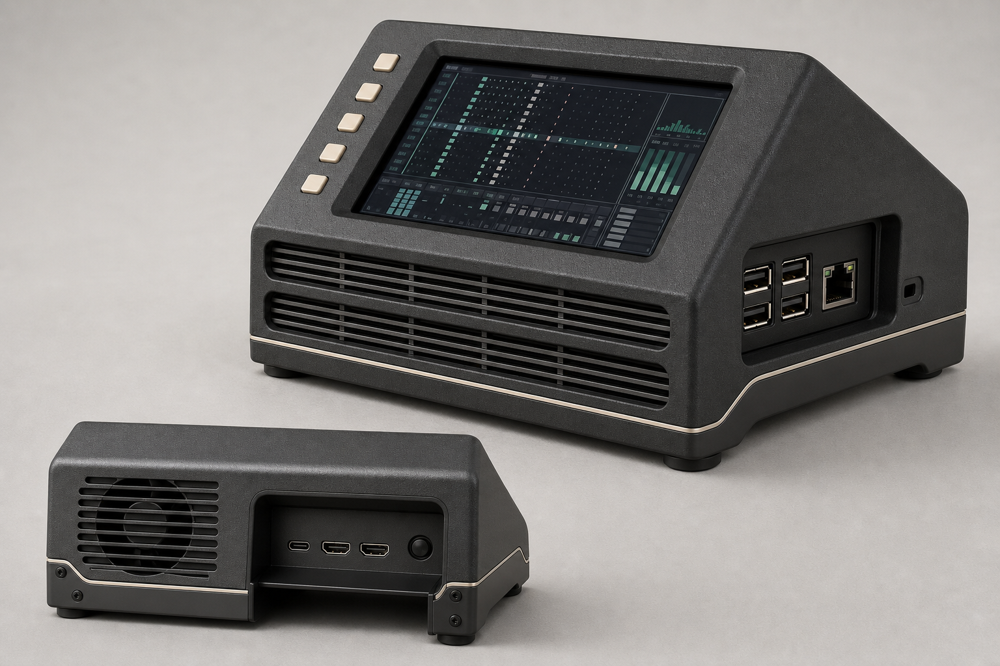

## 1. Final design

The resolved product is a compact wedge console, nominally **132 × 118 × 82 mm** (W×D×maximum H), with a 4-inch landscape screen at a provisional **24° above the desk**. Its rear structure drops to the supporting surface as a rigid aluminum heel, while the low front admits air directly into the display/Pi stack.

The Raspberry Pi remains in the repository’s current display orientation. Its awkward long-edge connectors are protected in a recessed rear cable hood; USB and Ethernet face a recessed right-side patch bay. This configuration was selected because it preserves the clean front-to-rear airflow path, avoids vulnerable cables at the operator-facing lower edge, and remains serviceable without electrically separating the GPIO-mounted display from the Pi.

The visual language is a restrained compact console: charcoal textured shell, graphite metal spine, horizontal warm-gray grilles, five small cream control keys, and one fine accent line—without fake meters, audio knobs, or decorative ports.

## 2. Repository and hardware findings

### Commit control

I inspected the GitHub tree pinned to **`927eb05888951f9955c7d46e856ef7208149bc00`**; the rendered page identifies it as `927eb05`. A local clone was attempted first but this environment could not resolve GitHub through Git, so there was no local checkout; repository conclusions below are limited to material inspected at the [exact pinned tree](https://github.com/PaolaShultz/shr-daw/tree/927eb05888951f9955c7d46e856ef7208149bc00) and its [pinned README](https://github.com/PaolaShultz/shr-daw/blob/927eb05888951f9955c7d46e856ef7208149bc00/README.md).

### Verified repository facts

- SHR-DAW is a Rust terminal application designed for a **40×13 terminal**, not a large touch-first GUI.
- It accepts a computer keyboard, mouse, or configured four-, five-, or eight-button controller.
- JACK is optional for browsing and external-MIDI sequencing but required for software instruments, loops, effects, and recording.
- The pinned material does not identify an exact display, SSD, NVMe adapter, rear fan, audio interface, or enclosure bottom plate.
- A 40×13 character field strongly favors a landscape screen; that is an inference, not a declared physical orientation.
- The repository does not establish native analog audio hardware. Therefore audio and MIDI connections are treated as external USB peripherals, not invented panel jacks.

### Verified Raspberry Pi facts

The current Raspberry Pi 5 product brief identifies:

- two USB 3.0 Type-A and two USB 2.0 Type-A ports;
- Gigabit Ethernet;
- **two micro-HDMI outputs**;
- **one USB-C power input**, specified for 5 V/5 A with Power Delivery;
- microSD, PCIe FFC, two MIPI camera/display interfaces, RTC, fan connector, GPIO and a native power button.

Thus, the brief’s “two USB-C connectors” is not a correct description of the native Pi edge: those two small adjacent sockets are **micro-HDMI**. There is no native analog audio jack on Pi 5. See the [official Pi 5 product brief](https://pip-assets.raspberrypi.com/categories/892-raspberry-pi-5/documents/RP-008348-DS-6-raspberry-pi-5-product-brief.pdf) and [hardware documentation](https://www.raspberrypi.com/documentation/computers/raspberry-pi.html).

The current mechanical drawing gives an approximate **85 × 58 mm hardware envelope** and explicitly requires physical-part verification before production data is generated. [Official mechanical drawing](https://pip-assets.raspberrypi.com/categories/892-raspberry-pi-5/documents/RP-008347-DS-1-raspberry-pi-5-mechanical-drawing.pdf?disposition=inline).

The official Active Cooler is verified at approximately **63.5 × 42.5 × 13.7 mm**, with a 5 V PWM blower, tachometer, and stated maximum airflow of 1.09 CFM. Raspberry Pi advises against repeatedly removing it because the push pins and thermal pads degrade. [Active Cooler product brief](https://datasheets.raspberrypi.com/cooling/raspberry-pi-active-cooler-product-brief.pdf).

### Explicit design assumptions

- **Display assumption:** Pimoroni HyperPixel 4.0 Touch, 800×480, 4-inch IPS, 86.4×51.8 mm active area and approximately 58.5×97×12 mm overall. It uses nearly the entire GPIO header, includes capacitive touch, and supports software rotation. [Pimoroni product page](https://shop.pimoroni.com/products/hyperpixel-4) and [current installation guide](https://cdn.learn.pimoroni.com/article/getting-started-with-hyperpixel-4).
- **NVMe assumption:** Pimoroni NVMe Base PIM699 under the Pi. It accepts M-key 2230–2280 drives and uses the Pi 5 PCIe FFC. Its drawing gives approximately **87.6×56 mm**, 1.6 mm PCB, 3.2 mm M.2 connector and 7 mm supplied standoffs. [Product page](https://shop.pimoroni.com/en-us/products/nvme-base) and [dimensional drawing](https://cdn.shopify.com/s/files/1/0174/1800/files/nvme-hat-drawing.pdf?v=1714386681).
- **Exhaust-fan assumption:** Noctua NF-A4x10 5V PWM. It is a 40×40×10 mm class fan, 0–5000 rpm, maximum 5.24 CFM and manufacturer-rated 19.6 dB(A) free-air maximum. Those figures do not predict installed acoustics. [Manufacturer specification](https://www.noctua.at/en/products/nf-a4x10-5v-pwm/specifications).

The display and NVMe are replaceable cassettes. A different display can be accommodated by changing the bezel/carrier if it remains within a provisional **106×70×18 mm** module envelope; the NVMe tray has slotted mounting for boards about 85–90×56 mm.

## 3. Orientation and connector decision

| Arrangement evaluated | Consequence | Decision |
|---|---|---|
| Current UI orientation; Pi long-edge ports at rear/top | Front intake stays open; power and occasional HDMI cables leave away from the operator; USB/Ethernet remain on the right | **Selected** |
| Rotate display/UI 180°; long-edge ports at front/bottom | USB-C and micro-HDMI plugs occupy the intake zone, require tight downward bends, collect dust and receive wrist/snags loads | Rejected |
| Rotate Pi independently using a different DSI/HDMI display or GPIO extender | Could optimize every connector, but abandons the assumed direct HyperPixel stack and adds signal, cable and service risk | Future variant only |

**Conclusion: do not rotate the final display/interface 180°.**

Software rotation is feasible: current Raspberry Pi firmware exposes `rotate=0/90/180/270`, and the HyperPixel overlay also exposes touch-axis inversion parameters. Pimoroni says graphical rotation should rotate touch, sometimes after restart. If a later display cassette forces a 180° change, both axes must be inverted and the four corners tested; screen rotation alone is insufficient. [Firmware overlay documentation](https://github.com/raspberrypi/firmware/blob/master/boot/overlays/README).

## 4. Mechanical and thermal specification

### Enclosure and stance

- Nominal exterior: **132 W × 118 D × 82 H mm**; front height approximately 38 mm.
- Display plane: **24° above horizontal**, provisional pending seated and standing reach tests.
- Rear heel: folded aluminum spine extending to the desk, with two ribs tying it to the display carrier.
- Feet: four 12–14 mm diameter, 3 mm thick silicone feet, inset about 8 mm from the footprint corners.
- Rear bumper: maintains at least 12 mm wall clearance so the exhaust cannot be placed flush against a vertical surface.
- Stability target for validation: no sliding or tipping under a 10 N screen-corner press, cable insertion, or moderate cable tug.

### Stack, top to bottom

1. Replaceable display bezel and 1 mm closed-cell gasket.
2. HyperPixel display cassette on M2.5 standoffs.
3. Display PCB underside nominally **21±1 mm above the Pi PCB**, leaving roughly 7 mm clear above the 13.7 mm Active Cooler envelope.
4. Raspberry Pi 5 with the official Active Cooler permanently fitted.
5. Supplied 7 mm NVMe Base standoffs, with SSD/component side facing the Pi as in Pimoroni’s assembly.
6. Pimoroni NVMe Base and 2230–2280 SSD.
7. Minimum 5 mm clearance below the Base PCB.
8. 1.5 mm folded 5052-H32 aluminum bottom/rear spine with a 0.5 mm insulating liner.

No thermal pad is specified between an unknown SSD and the metal base. Controller position, component height and allowable compression differ between drives; add a drive-specific heat bridge only after measuring the selected SSD.

### Airflow

- Two front louver bands provide a target **≥1,400 mm² effective free area** and align with two flow paths.
- Upper path washes the display PCB underside, supplies the Active Cooler inlet and carries its discharge rearward.
- Lower path enters the Pi/NVMe inter-board channel, crosses the SSD and Base electronics, then joins the exhaust stream.
- A thin internal splitter prevents the rear fan from taking a short path directly from the upper rear port opening.
- Rear fan sits left of the connector hood, exhausting **inside → rear/outside** through a gasketed duct.
- Fan-to-grille spacing: 5–7 mm, with rounded slots and silicone anti-vibration mounts to reduce blade-passing noise.
- Rear outlet effective area should be at least 1,000 mm².
- Foam gaskets seal the fan frame and connector hood so exhausted air cannot immediately return to the upper plenum.
- A side-removable coarse 30–40 PPI foam filter is optional. It is washable, not a fine particulate filter, and its pressure loss must be tested both clean and partially loaded.
- The Active Cooler remains connected only to the Pi’s dedicated four-pin fan header. The rear fan is independently powered and controlled.

### Controls and rear-fan board

Five unlabeled low-profile keys sit vertically on the left screen cheek, outside the intake. A provisional internal USB 2.0 hub/controller PCB:

- presents the keys as a standard HID keyboard/controller for an existing SHR-DAW profile;
- reserves one downstream USB port for the external side panel so four user-facing USB sockets remain available;
- powers the 5 V rear fan through a 250 mA resettable fuse;
- drives its PWM input through an open-drain stage and monitors tach;
- defaults the fan to full speed if the controller resets or loses PWM.

Button event mapping and the fan curve remain validation items. Touch, mouse and an external keyboard remain available recovery paths.

### Connector treatment

| Connector | Placement and access |
|---|---|
| USB-C power | Direct Pi connector in rear open-bottom hood; 18 mm recessed, provisional 32–35 mm plug/strain-relief envelope and 25 mm cable bend radius |
| 2× micro-HDMI | Same rear hood behind flexible dust shutters; normally unused but accessible without opening the enclosure |
| Native power button | Rear actuator/plunger beside the display outputs |
| 2× USB 3 Type-A | Directly exposed in right recessed bay |
| USB 2 Type-A | One direct external; the other feeds the internal two-port hub, whose spare downstream port returns to the same bay |
| Gigabit Ethernet | Right bay, with room for the latch and a reusable cable-tie slot |
| microSD | Left underside, behind a captive two-screw service door |
| 40-pin GPIO | Internal and occupied by the assumed HyperPixel; not user-accessible |
| PCIe FFC | Internal to NVMe Base; stock curved route retained without a crease |
| Active Cooler fan header | Internal, dedicated exclusively to the cooler |
| Two MIPI connectors | Internal; two sealed rear-bottom ribbon knockouts are provided but remain closed unless fitted |
| RTC battery and UART | Internal service connectors; space for the official RTC battery and a restrained harness |
| PoE | Not provided; Ethernet PoE+ requires a separate HAT incompatible with this display stack |
| Audio/MIDI | No native jacks are invented. Use a compliant USB audio interface and USB MIDI/controller hardware; use a powered hub for high-current combinations |

The side bay is recessed about 5 mm and includes a hook-and-loop anchor. Oversized dongles may require short extensions. The official 27 W supply is the design power baseline because Pi documentation reduces available peripheral current when a non-5 A supply is used.

### Construction and service

- **Prototype:** MJF/SLS PA12 shell at 2.5 mm nominal wall, laser-cut and folded 1.5 mm aluminum spine, threaded brass inserts, and printed fit coupons for each port.
- **Production:** injection-molded PC-ABS, preferably UL94 V-0, 2.0–2.4 mm walls, 1.5° draft and approximately 60% wall-thickness ribs; folded powder-coated aluminum spine; stamped 304 stainless grille mesh.
- M3 captive screws join shell to spine; M2.5 fasteners mount electronics. No routine service screw threads directly into plastic.
- Finish: fine charcoal texture, graphite powder coat, warm-gray grilles, cream PBT keycaps.

Assembly order:

1. Fit the Active Cooler permanently to the unpowered Pi.
2. Install the SSD onto the NVMe Base.
3. Fit the Base under the Pi and connect the PCIe FFC.
4. Install the right-side USB hub/controller, button harness and fan.
5. Mount the display on its validated extended header/standoffs.
6. Attach the complete electronics cassette to the aluminum spine.
7. Slide it into the upper shell and fit the fan duct and filter.
8. Close the insulated bottom panel with four captive M3 screws.

The filter and fan hatch can be serviced without removing the display. The electronics cassette removes from below; the Active Cooler stays attached to the Pi.

## 5. The picture

The single image shows the selected front-right view and a rear inset of the same unit, including the screen stance, two-band intake, five-key rail, right connector bay, rear exhaust, cable hood and leveling heel.

File: [shr-daw-console-final.png](concept-board.png) — 1536×1024 PNG.

## 6. Risks and validation

| Risk or unknown | Required check before fabrication |
|---|---|
| Display and NVMe identity remain assumptions | Photograph and measure all installed hardware; import supplier STEP files and produce port/stack fit coupons |
| Active Cooler versus display clearance | Measure installed cooler and header heights; verify ≥6 mm unobstructed inlet clearance across the blower |
| PCIe FFC strain | Assemble the real Base with stock cable; inspect bend and connector loads through ten service cycles |
| USB-C and micro-HDMI plug variation | Gauge with the official PSU plus the largest intended HDMI plug; validate hood and strain-relief envelopes |
| Thermal performance | Run sustained SHR-DAW synth/recording load plus continuous NVMe writes at 25°C and 35°C ambient; log CPU temperature/throttling, SSD SMART temperature and display PCB thermocouples |
| Rear-fan failure or blocked grille | Repeat thermal test with fan disconnected and filter 50% obstructed; verify graceful throttling and establish shutdown guidance |
| Acoustics near recording microphones | Measure A-weighted SPL and recorded microphone noise at 0.5 m over the PWM range; check grille tones and shell resonance |
| USB power budget | Measure the full display, cooler, SSD, control board, fan, audio interface and MIDI load; require a powered hub where necessary |
| UI, touch and button mapping | Cold-boot through console and application; test four touch corners, mouse navigation, all five key events and keyboard recovery |
| Backlight after soft shutdown | HyperPixel warns that its backlight may remain on; verify behavior and instruct users to switch or disconnect the external PSU for a true off state |
| Stability and strength | Touch/cable-load testing, drop-on-feet testing and tip testing with the heaviest intended cables attached |
| Dust and maintenance | Compare clean and loaded-filter pressure drop, inspect deposits after an accelerated dust test, then set a realistic cleaning interval |

No thermal capacity, acoustic level, fit, structural strength, regulatory compliance or production manufacturability is claimed as proven.

## 7. Comparison record

| Field | Resolved record |
|---|---|
| Repository | `https://github.com/PaolaShultz/shr-daw` |
| Authoritative commit | `927eb05888951f9955c7d46e856ef7208149bc00` |
| Research date | 2026-07-24 |
| Identified hardware | Raspberry Pi 5; official Active Cooler |
| Assumed hardware | HyperPixel 4.0 Touch; Pimoroni NVMe Base PIM699; Noctua NF-A4x10 5V PWM; custom USB HID/fan controller |
| Unknown hardware | Actual display revision, NVMe adapter and SSD, audio interface, MIDI devices, PSU cable geometry and production bottom plate |
| Display orientation and angle | Landscape, repository’s current upright orientation, no 180° rotation; provisional 24° above desk |
| Connector strategy | USB-C power and 2× micro-HDMI in rear hood; four user-facing USB-A plus Ethernet in right bay; microSD through left-bottom door; internal-only GPIO/PCIe/MIPI/RTC/UART |
| External dimensions | Provisional 132×118×82 mm; approximately 38 mm front height |
| Cooling | Dual front intake plenums → display/CPU and NVMe lanes → rear 40 mm 5 V PWM exhaust; official Active Cooler remains independent |
| Fan and direction | Noctua NF-A4x10 5V PWM, 40×40×10 mm class; rear exhaust, inside to outside |
| Component stack | Display cassette → 21±1 mm Pi/display spacing → Pi 5 + Active Cooler → 7 mm standoffs → NVMe Base/SSD → insulated aluminum spine |
| Materials and route | MJF PA12 plus folded 5052 aluminum for prototype; PC-ABS injection molding plus folded aluminum and stainless mesh for production |
| Service access | Captive bottom panel/electronics cassette, separate fan hatch, sliding filter and microSD door |
| Principal advantages | Clear front intake, protected power/HDMI cables, organized USB/audio/MIDI access, stable rear heel, removable component cassettes |
| Principal compromises | Larger than the bare stack; custom USB control board; one native USB2 routed through a hub; front filter and rear fan add pressure/noise |
| Unresolved assumptions | Exact component topography, extended-header signal integrity, fan curve, cable bend envelopes, thermal margins and button profile |
| Sources used | [Pinned repository](https://github.com/PaolaShultz/shr-daw/tree/927eb05888951f9955c7d46e856ef7208149bc00); [Pi 5 brief](https://pip-assets.raspberrypi.com/categories/892-raspberry-pi-5/documents/RP-008348-DS-6-raspberry-pi-5-product-brief.pdf); [Pi mechanics](https://pip-assets.raspberrypi.com/categories/892-raspberry-pi-5/documents/RP-008347-DS-1-raspberry-pi-5-mechanical-drawing.pdf?disposition=inline); [Active Cooler](https://datasheets.raspberrypi.com/cooling/raspberry-pi-active-cooler-product-brief.pdf); [HyperPixel](https://shop.pimoroni.com/products/hyperpixel-4); [NVMe Base](https://shop.pimoroni.com/en-us/products/nvme-base); [Noctua fan](https://www.noctua.at/en/products/nf-a4x10-5v-pwm/specifications) |
| Image filename | `shr-daw-console-final.png` |